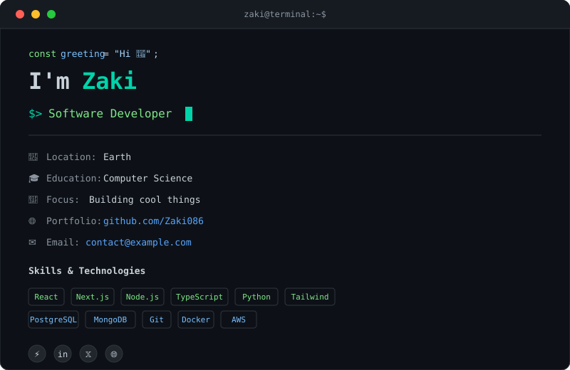

<!-- ═══════════════════════════════════════════════════════════════════════════ -->
<!--  LIQUID MORPH WORDMARK  —  Identity layer                                  -->
<!--  Self-hosted SVG with SMIL path morphing. No GIFs. No external deps.        -->
<!-- ═══════════════════════════════════════════════════════════════════════════ -->
<p align="center">
  
</p>

<!-- ═══════════════════════════════════════════════════════════════════════════ -->
<!--  TERMINAL INTRO CARD  —  Who you are                                       -->
<!-- ═══════════════════════════════════════════════════════════════════════════ -->
<p align="center">
  
</p>

<br>

<!-- ═══════════════════════════════════════════════════════════════════════════ -->
<!--  CURRENT FOCUS  —  What you are working on right now                       -->
<!-- ═══════════════════════════════════════════════════════════════════════════ -->
<h3 align="center"><code>$ cat current_focus.txt</code></h3>

<pre align="center">
&gt; building:   an awesome CLI tool
&gt; learning:   System Design
&gt; experimenting: Local LLMs
&gt; shipping:   v2.0 of my profile
</pre>

<br>

<!-- ═══════════════════════════════════════════════════════════════════════════ -->
<!--  GITHUB DATA DASHBOARD  —  Live metrics, auto-refreshed daily              -->
<!-- ═══════════════════════════════════════════════════════════════════════════ -->

<!-- GitHub Stats Dashboard -->
<p align="center">
  
</p>

<!-- Top Languages -->
<p align="center">
  
</p>

<br>

<!-- ═══════════════════════════════════════════════════════════════════════════ -->
<!--  ACTIVITY PULSE  —  How this developer actually works                      -->
<!-- ═══════════════════════════════════════════════════════════════════════════ -->
<p align="center">
  
</p>

<br>

<!-- ═══════════════════════════════════════════════════════════════════════════ -->
<!--  PAC-MAN CONTRIBUTION GRAPH  —  Arcade easter egg                          -->
<!--  Generated daily via GitHub Actions. SVG animation, no GIF.                -->
<!-- ═══════════════════════════════════════════════════════════════════════════ -->
<p align="center">
  <picture>
    <source media="(prefers-color-scheme: dark)" srcset="https://raw.githubusercontent.com/Zaki086/Zaki086/output/pacman-contribution-graph-dark.svg">
    <source media="(prefers-color-scheme: light)" srcset="https://raw.githubusercontent.com/Zaki086/Zaki086/output/pacman-contribution-graph.svg">
    
  </picture>
</p>

<p align="center">
  <code>HIGH SCORE · CONTRIBS</code> ·
  <code>STREAK · ACTIVE</code> ·
  <code>STAGE · Engineer</code>
</p>

<br>

<!-- ═══════════════════════════════════════════════════════════════════════════ -->
<!--  FEATURED PROJECTS  —  Curated engineering work                            -->
<!--  Replace with your actual repositories. Keep it tight: 3–6 max.            -->
<!-- ═══════════════════════════════════════════════════════════════════════════ -->
<h3 align="center">┌─ FEATURED PROJECTS ─┐</h3>

<table align="center" width="90%">
  <tr>
    <td width="50%" valign="top">

```
┌────────────────────────────────────────┐
│ 01  Terminal Dashboard                   │
│     A terminal inspired GitHub profile            │
│     [TypeScript] [React] [Python]  │
└────────────────────────────────────────┘
```
<p align="right">
  <a href="https://github.com/Zaki086/Zaki086"><code>source →</code></a>
  &nbsp;
  <a href="https://github.com/Zaki086"><code>live →</code></a>
</p>

    </td>
    <td width="50%" valign="top">

```
┌────────────────────────────────────────┐
│ 02  System Monitor                   │
│     Real-time performance tracking            │
│     [TypeScript] [React] [Python]  │
└────────────────────────────────────────┘
```
<p align="right">
  <a href="https://github.com/Zaki086/sys-mon"><code>source →</code></a>
  &nbsp;
  <a href="https://github.com/Zaki086"><code>live →</code></a>
</p>

    </td>
  </tr>
  <tr>
    <td width="50%" valign="top">

```
┌────────────────────────────────────────┐
│ 03  AI Agent                   │
│     Automated coding assistant            │
│     [TypeScript] [React] [Python]  │
└────────────────────────────────────────┘
```
<p align="right">
  <a href="https://github.com/Zaki086/ai-agent"><code>source →</code></a>
  &nbsp;
  <a href="https://github.com/Zaki086"><code>live →</code></a>
</p>

    </td>
    <td width="50%" valign="top">

```
┌────────────────────────────────────────┐
│ 04  Portfolio                   │
│     My personal portfolio site            │
│     [TypeScript] [React] [Python]  │
└────────────────────────────────────────┘
```
<p align="right">
  <a href="https://github.com/Zaki086/portfolio"><code>source →</code></a>
  &nbsp;
  <a href="https://github.com/Zaki086"><code>live →</code></a>
</p>

    </td>
  </tr>
</table>

<br>

<!-- ═══════════════════════════════════════════════════════════════════════════ -->
<!--  RECENT ACTIVITY  —  Latest signal from your GitHub                        -->
<!-- ═══════════════════════════════════════════════════════════════════════════ -->
<h3 align="center">┌─ RECENT ACTIVITY ─┐</h3>

<p align="center">
  
</p>

<br>

<!-- ═══════════════════════════════════════════════════════════════════════════ -->
<!--  CONNECT  —  Where to find you                                             -->
<!-- ═══════════════════════════════════════════════════════════════════════════ -->
<h3 align="center">┌─ CONNECT ─┐</h3>

<p align="center">
  <a href="https://github.com/Zaki086"><code>github</code></a> &nbsp;·&nbsp;
  <a href="https://github.com/Zaki086"><code>portfolio</code></a> &nbsp;·&nbsp;
  <a href="https://linkedin.com/in/zaki"><code>linkedin</code></a> &nbsp;·&nbsp;
  <a href="https://twitter.com/zaki086"><code>twitter</code></a> &nbsp;·&nbsp;
  <a href="mailto:contact@example.com"><code>email</code></a>
</p>

<br>

<!-- ═══════════════════════════════════════════════════════════════════════════ -->
<!--  FOOTER  —  Minimal attribution + build info                               -->
<!-- ═══════════════════════════════════════════════════════════════════════════ -->
<p align="center">
  <sub>
    <code>built with</code> 
    <a href="https://github.com/lowlighter/metrics">lowlighter/metrics</a> 
    <code>+</code> 
    <a href="https://github.com/abozanona/pacman-contribution-graph">pacman-contribution-graph</a> 
    <code>+</code> 
    SMIL
  </sub>
</p>

<p align="center">
  <sub><code>last updated via GitHub Actions · daily refresh</code></sub>
</p>
